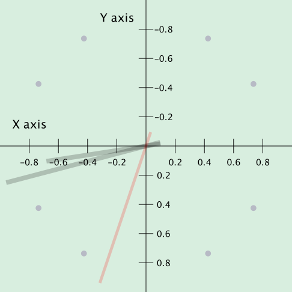

# ClockApp

ClockApp is a customizable, Java-based analog clock application built with Swing.
It supports theming via JSON-defined clock faces that control the look and feel
of the clock: clock face, hour hand, minute hand, second hand.

The project is designed as both a lightweight utility and a playground for experimenting with UI customization in Java. You can load different clock styles at runtime, making it easy to switch between minimal, retro, neon, or experimental faces.
## Features
- 🕒 Analog Clock Rendering – Smooth drawing of hour, minute, and second hands using Swing.
- 🎨 Custom Styles with JSON – Define clock faces declaratively (polygons, text, rectangles, and circles).
- 🔄 Live Updates – Clock redraws in real time with system time.
- 🧩 Extensible Design – Add new styles easily by dropping a JSON definition into the styles folder.
- 💻 Lightweight – Runs anywhere Java runs, with no external dependencies beyond Gson.
---

## Why ClockApp?
This project is both a functional desktop clock and an educational example of how to:
- Work with Java Swing graphics including JTimers and non-rectangular JWindows.
- Use JSON-driven design for flexible UI rendering.
- Explore creative visualizations (traditional faces, futuristic designs, or playful experiments).
---
## How to Run
```
# Clone the repo
git clone https://github.com/nick963/clockapp.git
cd clockapp
mvn clean compile exec:java -Dexec.mainClass="org.clock.ClockApp"
```
---
## Clock App Usage

- Moving: To move the clock, click on it and drag.
- Resize: To resize the clock, <shift> click on the clock and drag.

Right click on clock to explore the Clock App's functionality:
- *Built-in clock faces*: Before the first separator in the popup menu you can load
  pre-built clock faces.
- **Load JSON Clock File...**: Allows you to load a JSON defined clock face (see documentation
  below for JSON Schema).
- **Save Clock Image...**: Save a snapshot PNG of the currently displayed clock.
- **Quit**: Quit the Clock App.
---
## JSON Schema
The schema to define clocks in JSON is minimal:
```json
{
  "name": "Name of Clock",
  "clock_face": [],
  "second_hand": [],
  "minute_hand": [],
  "hour_hand": []
}
```
| clock object keys | key description                                                                                      |
|-------------------|------------------------------------------------------------------------------------------------------|
| name              | Name of the clock.                                                                                   |
| description       | Description of the clock.                                                                            |
| clock_face        | List of shapes for the clock's face.                                                                 |
| second_hand       | List of shapes for the clock's second hand. It should be oriented towards 12:00 and will be rotated. |
| minute_hand       | List of shapes for the clock's minute hand.                                                          |
| hour_hand         | List of shapes for the clock's hour hand.                                                            |

### JSON Shapes Schema

#### Key Characteristics of the Coordinate System
- **Origin**: The origin is in the center of the clock face.
- **X-axis**: The x-values increase as you move to the right. This is the same as a standard Cartesian coordinate system.
- **Y-axis**: The y-values increase as you move down. This is the opposite of a standard Cartesian system, where y-values
  increase as you move up. This is consistent with computer screens and visual displays.
- **Drawing Area**: The radius of the clock face is 1.0. The application will scale that clock if the user increases the
  size.
- 

There are 4 shapes that can be used to construct the clocks: "rectangle", "polygon", "text", "circle".

| shape object keys | key description                                                                             | applicable shapes |
|-------------------|---------------------------------------------------------------------------------------------|-------------------|
| shape             | String with the following possible string values: "rectangle", "polygon", "text", "circle". | all               |
| x                 | x position of the shape.                                                                    | all but polygon   |
| y                 | y position of the shape.                                                                    | all but polygon   |
| color             | shape color, example simple format "#0F0F0F". For alpha channel, use "#0F0F0F0F".           | all               |
| ticks             | whole value between 2 and 60. The shape will repeat around the clock the number of ticks.   | all               |
| text              | text string to draw.                                                                        | text              |
| font              | font for text.                                                                              | text              |
| size              | font size for text.                                                                         | text              |
| styles            | font styles for text (separated by commas): "bold", "italic", or "plain".                   | text              |
| radius            | radius of the circle.                                                                       | circle            |
| fx                | from x position of the rectangle.                                                           | rectangle         |
| fy                | from y position of the rectangle.                                                           | rectangle         |
| tx                | to x position of the rectangle.                                                             | rectangle         |
| ty                | to y position of the rectangle.                                                             | rectangle         |
| points            | list of points. Each point is a JSON object with x and y key-values.                        | polygon           |

See the [example clocks](./src/main/resources/json/styles/examples) which illustrate the usage of shapes.
## License

This project is licensed under the Apache License. See [LICENSE](LICENSE) for details.
